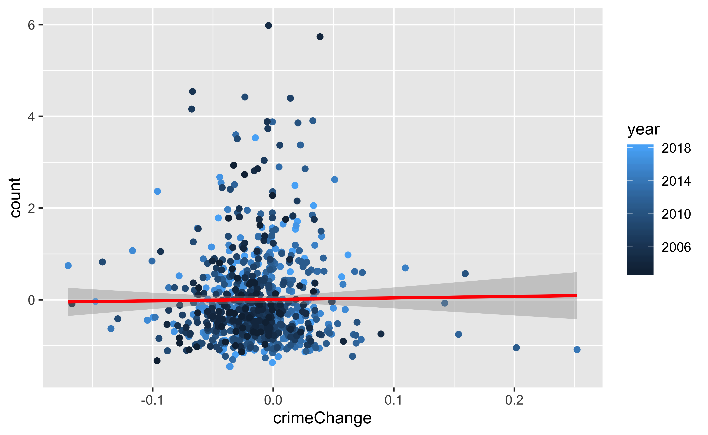
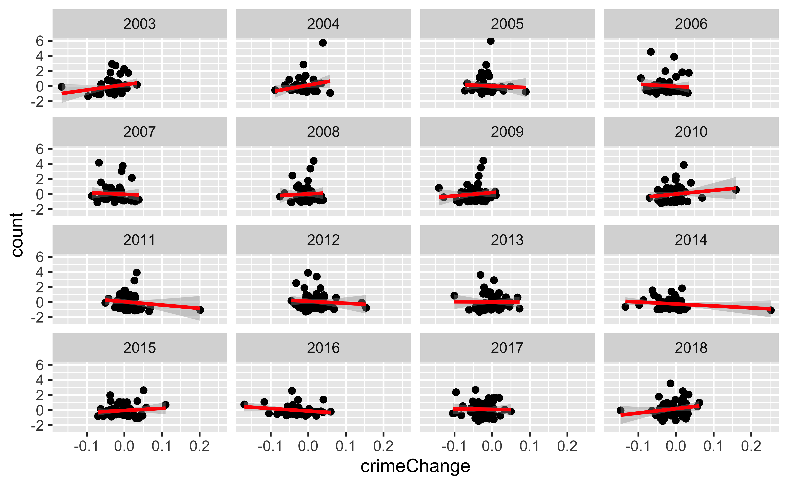
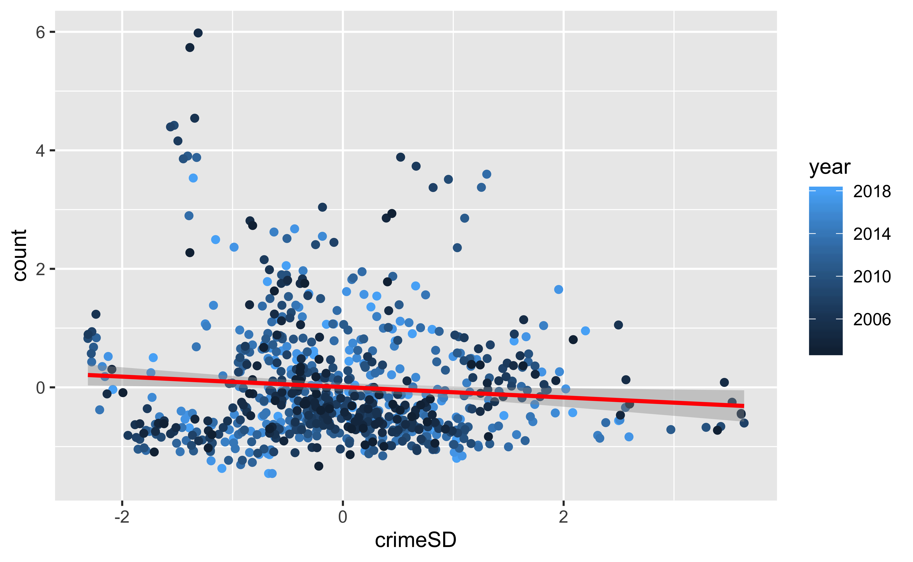
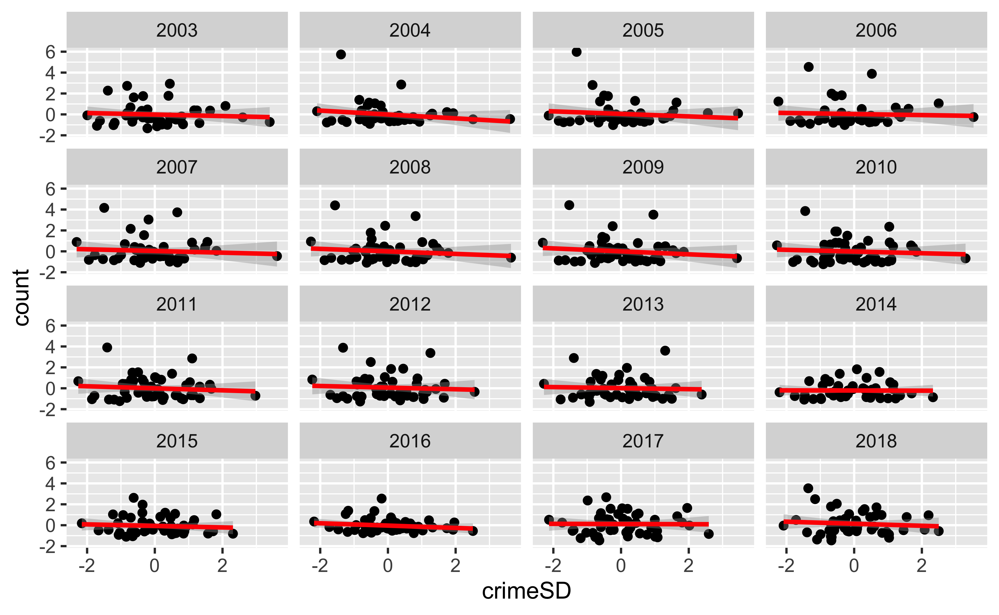

```{r setup, include=FALSE}
knitr::opts_chunk$set(
  echo = TRUE,
  dpi = 300,
  R.options = list(width = 60)
)

# Learn more about creating websites with Distill at:
# https://rstudio.github.io/distill/website.html

# Learn more about publishing to GitHub Pages at:
# https://rstudio.github.io/distill/publish_website.html#github-pages

```

```{r packageCheck, include=FALSE}
mypacks <- c("plotly", "tidyverse", "sp", "sf", "shiny", "shinydashboard", "shinyjs", "DT", "mapdeck", "rgdal", "readxl", "readr", "rio", "ggplot2","dplyr", "ROCR", "boot","class","randomForest","e1071", "stringr","partykit","rpart", "sp", "glmnet","forcats","tidyverse","caret", "curl", "colourvalues", "downloader")  # what packages are needed?
packs <- installed.packages()   # find installed package list
install.me <- mypacks[!(mypacks %in% packs[,"Package"])]  #what needs to be installed?
if (length(install.me) >= 1) install.packages(install.me, repos = "http://cran.us.r-project.org")   # install (if needed)
lapply(mypacks, library, character.only=TRUE)  # load all packages
```

```{r, echo = FALSE, layout = "l-screen-inset"}
knitr::include_app( "http://samuellee19.shinyapps.io/SFQ_Final_Project")
```

# Project Overview
## Background:
The **Stop, Question and Frisk** program is a practice, utilized by New York City Police Department (NYPD), of temporarily halting, questioning, and, in certain cases, searching civilians on the street for weapons and other dangers. It is also called "Terry Stop," named after the Supreme Court case Terry v. Ohio (1968).

The use of **Stop, Question and Frisk** practice is often endorsed with the Broken Windows Theory, suggesting that even **low-level crimes and civil disorder leads to more serious crimes in urban enviornments.** In fact, after NYPD officer Adrian Schoolcraft made extensive recordings on the department's Stop and Frisk policy, numerous civil rights organizations, such as NYCLU, raised a concern that the program **unfairly targest certain minorities, such as African-Americans and Hispanic-Americans**. Similarly, the Guardian reporter also noted that "since 2002 (the Kelly/Bloomberg years), over 35% of officers feel high pressure to write stop-and-frisk reports...felt less pressire to obey consitutional constraints."[@eterno_silverman_2013] 

A major turning point was the 2013 court case Floyd v. City of New York and a subsequent NYPD mandate that requires officers to thoroughly justify the reason for making a stop. After Bloomberg's mayorship ended, Bill de Blasio took over the office and pledged for a major reform on NYPD policies. 

For this project, we will be using New York City data on Stop and Frisk practice, from 2003 to 2018. Due to formatting changes happened circa 2017, data from 2017-2018 period will be limited to visualization process. Hence, we will determine changes from 2003-2007, 2007-2012, and 2013-2016 periods.

## Project Objectives:
1. Visualize the data to get intuit
2. Visualize the data to get intuition for aspects involved
  - Urgency of crime
3. Find if there's some effect of Bloomberg's Policy
  - Determine what the main factors involved were in each of the three times
  - Make a variable to indicate what era it was in, remove year indicator, see what the regression is like and weight given to era binary variables

----------------

# Methodologies
## Data Used
1. Crime Analysis
2. Policy Analysis
- Have data from 2003-2018; 2003-2016 one format, 2017-2018 in different format
- split data 2003-2007, 2008-2012, then 2013-2016
- Combine data with crime rates per precinct for previous year, because you'd expect more unsafe areas to have more stop and frisk/safety patrolling, see trend between stop and frisk and crime rate of area
- See further what drives stop and frisk between areas by splitting it up by era and seeing main variables

## Visualizations

For this project, we mostly used `library(mapdeck)` to create **screengrid** and **hexagon objects** to show density of Stop and Frisk events across our timeline, as you can see from the above dashboard. 

```{r, fig.cap = "Spatial Points of Stop and Frisk Data (2017-2018) with Plotly and Mapbox", layout = "1-page", echo = FALSE, fig.height = 3}
# Data Munging and Spatial Attributes for Visualization
load(url("https://www.dropbox.com/s/mv6mgp9quu92fia/plot_locations_1718.RData?dl=1"))
load(url("https://www.dropbox.com/s/pf5fedyiflf8x34/plot_locations_1718SF.RData?dl=1"))

Sys.setenv('MAPBOX_TOKEN' = 'pk.eyJ1Ijoic2xlZTE5IiwiYSI6ImNrNDZmbWl1aTBqcmgzZW8xeDJzcTBsMXEifQ.OvJvDwdVBfB02NaJVLq7Fw')

p <- plot_locations_1718 %>%
  plot_mapbox(mode = 'scattermapbox', hoverinfo='name') %>%
  layout(font = list(color='white'),
         plot_bgcolor = '#191A1A', paper_bgcolor = '#191A1A',
         mapbox = list(style = 'dark'))
p
```

This is a basic interactive scatterplot of 2017-2018 Period data created on Plotly and Mapbox. We can see that spatial points are dispersed across all of New York City boroughs. While this scatterplot allows us to see where **Stop, Question, and Frisk** practices are happening, there is no way to be certain which areas have higher rate or density of occurance. In order to resolve the issue, we created a screengrid interactive that you can zoom in and out, tilt, and move around.

Basic Control Guidance for Mapbox (Mapdeck):
- Moving: **Arrow Keys**
- Zoom: **Scroll Wheel**
- Tilting: **Control (Command on mac) + Shift + Arrow Keys**

| Control Options  | Description                                       |
|------------------|---------------------------------------------------|
| Moving           | Arrow Keys                                        |
| Zoom             | Scroll Wheels or Trackpad Zoom                    |
| Tilt/Orientation | `Control` (`Command` on Mac) + Shift + Arrow Keys |

```{r mapdeck, layout='l-screen', fig.height=2, out.width='100%', fig.align='center', echo = FALSE} 
mapdeck(token = "pk.eyJ1Ijoic2xlZTE5IiwiYSI6ImNrNDZmbWl1aTBqcmgzZW8xeDJzcTBsMXEifQ.OvJvDwdVBfB02NaJVLq7Fw", style = mapdeck_style("dark"), pitch = 45) %>%
  add_screengrid(data = plot_locations_1718,
                 weight = "weight",
                 layer_id = "screengrid_layer",
                 cell_size = 6,
                 opacity = 0.4,
                 colour_range = colourvalues::colour_values(1:6, palette = "plasma")) %>%
  add_hexagon(data = plot_locations_1718SF,
              layer_id = "hex_layer",
              radius = 6
              )
```

It is also important to mention that the density is expressed by color. From the map, we can see that there are significantly more density in northern parts of and above Manhattan, such as East Harlem, Fordham, and Bronx. Since East Harlem and Fordham have significant minority population, it would be interesting to see whether race has an influence over decision-making of NYPD's Stop, Question, and Frisk practice. 

You can also conduct further interaction with more data points and options with a dashboard that we created on the top.
(NOTE: some features could take some time to render due to size of our data)

## Effect of Stop and Frisk on Crime Rates
- Analyze stop and frisk amount as standard deviation for the year vs the change in crime amount from current to previous year, again as a standard deviation

```{r, layout = "1-body-outset", warning = FALSE, echo = FALSE}
library(knitr)

```

```{r, layout = "1-body-outset", warning = FALSE, echo = FALSE}

```

- Change wasn't related to number of stop and frisks as a whole
- Sometimes by year had some negative trends, which means the crime decreased as there were more stop and fridks, but also have some years with a positive trend meaning that areas with more stop and frisk also had an increase in crime

## Relationship Between Crime and Stop And Frisk

```{r, layout = "1-body-outset", warning = FALSE, tidy=FALSE, echo = FALSE}
# Graphing standard deviation of crime count vs standard deviation number of stop and frisks by year, and then coloring by year
# No trend in data at all
 
```

```{r, layout = "1-body-outset", warning = FALSE, tidy=FALSE, echo = FALSE}
# Seperating by year in case policy changes had an effect, no clear trend still

```

- No trend in values or clear positive trend
- Clearly not based on past crime rate, other factor at play?

## What Factors Actually Matter: Analysis of Effects of Change on Policy
1. Splitting it into three data sets, running 2-3 different feature based regressions to see most important variables, finding average importance across each variable type and comparing
2. Setting a binary variable to indicate which time period it was in relative to Bloomberg, see weight of that variable given in the different regression methods.

```{r, echo=FALSE}
# Determing which columns aren't there in all the data sets, so which to drop for variable comparison
```

----------------

# Findings and analysis
1. No connection between stop and frisk and changes in crime rate
2. No connection between stop and frisk and crime of an area

----------------

# Conclusion
