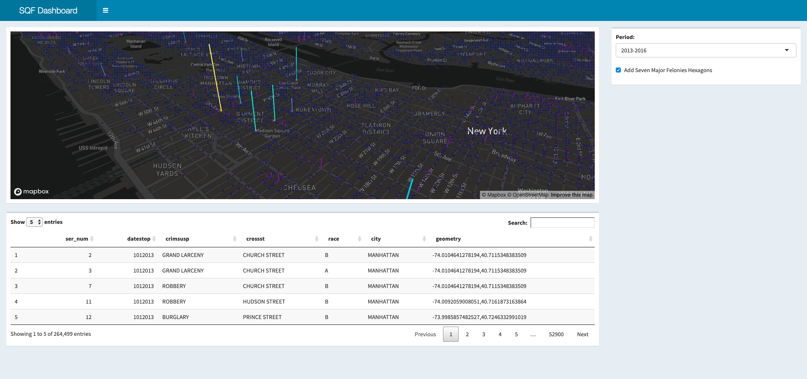

```{r setup, include=FALSE}
knitr::opts_chunk$set(
  echo = TRUE,
  dpi = 300,
  R.options = list(width = 60)
)

# Learn more about creating websites with Distill at:
# https://rstudio.github.io/distill/website.html

# Learn more about publishing to GitHub Pages at:
# https://rstudio.github.io/distill/publish_website.html#github-pages

```

```{r packageCheck, include=FALSE}
mypacks <- c("plotly", "tidyverse", "sp", "sf", "shiny", "shinydashboard", "shinyjs", "DT", "mapdeck", "rgdal", "readxl", "readr", "rio", "ggplot2","dplyr", "ROCR", "boot","class","randomForest","e1071", "stringr","partykit","rpart", "sp", "glmnet","forcats","tidyverse","caret", "curl", "colourvalues", "downloader")  # what packages are needed?
packs <- installed.packages()   # find installed package list
install.me <- mypacks[!(mypacks %in% packs[,"Package"])]  #what needs to be installed?
if (length(install.me) >= 1) install.packages(install.me, repos = "http://cran.us.r-project.org")   # install (if needed)
lapply(mypacks, library, character.only=TRUE)  # load all packages
```

```{r, fig.cap = "Due to Comaptility issue with GitHub Pages, please go to https://samuellee19.shinyapps.io/SFQ_Final_Project/ to use interactive dashboard.", echo = FALSE, layout = "l-screen-inset"}

```

# Project Overview
## Background:
The **Stop, Question and Frisk** program is a practice, utilized by New York City Police Department (NYPD), of temporarily halting, questioning, and, in certain cases, searching civilians on the street for weapons and other dangers. It is also called "Terry Stop," named after the Supreme Court case Terry v. Ohio (1968).

The use of **Stop, Question and Frisk** practice is often endorsed with the Broken Windows Theory, suggesting that even **low-level crimes and civil disorder leads to more serious crimes in urban enviornments.** In fact, after NYPD officer Adrian Schoolcraft made extensive recordings on the department's Stop and Frisk policy, numerous civil rights organizations, such as NYCLU, raised a concern that the program **unfairly targest certain minorities, such as African-Americans and Hispanic-Americans**. Similarly, the Guardian reporter also noted that "since 2002 (the Kelly/Bloomberg years), over 35% of officers feel high pressure to write stop-and-frisk reports...felt less pressire to obey consitutional constraints."[@eterno_silverman_2013] 

A major turning point was the 2013 court case Floyd v. City of New York and a subsequent NYPD mandate that requires officers to thoroughly justify the reason for making a stop. After Bloomberg's mayorship ended, Bill de Blasio took over the office and pledged for a major reform on NYPD policies. 

For this project, we will be using New York City data on Stop and Frisk practice, from 2003 to 2018. Due to formatting changes happened circa 2017, data from 2017-2018 period will be limited to visualization process. Hence, we will determine changes from 2003-2007, 2007-2012, and 2013-2016 periods.

## Project Objectives:
1. Visualize the data to get intuit
2. Visualize the data to get intuition for aspects involved
  - Urgency of crime
3. Find if there's some effect of Bloomberg's Policy
  - Determine what the main factors involved were in each of the three times
  - Make a variable to indicate what era it was in, remove year indicator, see what the regression is like and weight given to era binary variables

----------------

# Methodologies
## Data Used
1. Crime Analysis
2. Policy Analysis
- Have data from 2003-2018; 2003-2016 one format, 2017-2018 in different format
- split data 2003-2007, 2008-2012, then 2013-2016
- Combine data with crime rates per precinct for previous year, because you'd expect more unsafe areas to have more stop and frisk/safety patrolling, see trend between stop and frisk and crime rate of area
- See further what drives stop and frisk between areas by splitting it up by era and seeing main variables

## Visualizations
For this project, we mostly used `library(mapdeck)` to create **screengrid** and **hexagon objects** to show density of Stop and Frisk events across our timeline, as you can see from the above dashboard. 

```{r, fig.cap = "Spatial Points of Stop and Frisk Data (2017-2018) with Plotly and Mapbox", layout = "1-page", echo = FALSE, fig.height = 3}
# Data Munging and Spatial Attributes for Visualization
load(url("https://www.dropbox.com/s/mv6mgp9quu92fia/plot_locations_1718.RData?dl=1"))
load(url("https://www.dropbox.com/s/pf5fedyiflf8x34/plot_locations_1718SF.RData?dl=1"))

Sys.setenv('MAPBOX_TOKEN' = 'pk.eyJ1Ijoic2xlZTE5IiwiYSI6ImNrNDZmbWl1aTBqcmgzZW8xeDJzcTBsMXEifQ.OvJvDwdVBfB02NaJVLq7Fw')

p <- plot_locations_1718 %>%
  plot_mapbox(mode = 'scattermapbox', hoverinfo='name') %>%
  layout(font = list(color='white'),
         plot_bgcolor = '#191A1A', paper_bgcolor = '#191A1A',
         mapbox = list(style = 'dark'))
p
```

This is a basic interactive scatterplot of 2017-2018 Period data created on Plotly and Mapbox. We can see that spatial points are dispersed across all of New York City boroughs. While this scatterplot allows us to see where **Stop, Question, and Frisk** practices are happening, there is no way to be certain which areas have higher rate or density of occurance. In order to resolve the issue, we created a screengrid interactive that you can zoom in and out, tilt, and move around:

| Control Options  | Description                                       |
|------------------|---------------------------------------------------|
| Moving           | Arrow Keys                                        |
| Zoom             | Scroll Wheels or Trackpad Zoom                    |
| Tilt/Orientation | `Control` (`Command` on Mac) + Shift + Arrow Keys |

```{r mapdeck, layout='l-screen', fig.height=2, out.width='100%', fig.align='center', echo = FALSE} 
mapdeck(token = "pk.eyJ1Ijoic2xlZTE5IiwiYSI6ImNrNDZmbWl1aTBqcmgzZW8xeDJzcTBsMXEifQ.OvJvDwdVBfB02NaJVLq7Fw", style = mapdeck_style("dark"), pitch = 45) %>%
  add_screengrid(data = plot_locations_1718,
                 weight = "weight",
                 layer_id = "screengrid_layer",
                 cell_size = 6,
                 opacity = 0.4,
                 colour_range = colourvalues::colour_values(1:6, palette = "plasma")) %>%
  add_hexagon(data = plot_locations_1718SF,
              layer_id = "hex_layer",
              radius = 6
              )
```

It is also important to mention that the density is expressed by color. From the map, we can see that there are significantly more density in northern parts of and above Manhattan, such as East Harlem, Fordham, and Bronx. Since East Harlem and Fordham have significant minority population, it would be interesting to see whether race has an influence over decision-making of NYPD's Stop, Question, and Frisk practice. 

You can also conduct further interaction with more data points and options with a dashboard that we created on the top. You can also access the dashboard at https://samuellee19.shinyapps.io/SFQ_Final_Project/.
(NOTE: some features could take some time to render due to size of our data)

## Effect of Stop and Frisk on Crime Rates
To begin, we wanted to analyze whether stop and frisk actually practices seem to have any impact on the crime rate seen in an area. Therefore, using the data described above, we decided to visualize **the effect of the stop and frisks on the crime rate of an area, by precinct.** To do this, we first normalized the number of stops per precinct over a year. We then found the rate of change in the amount of crime per precinct for each year we had data on. Finally, we graphed this information, as shown below.

```{r, layout = "1-body-outset", warning = FALSE, echo = FALSE}
library(knitr)

```

```{r, layout = "1-body-outset", warning = FALSE, echo = FALSE}

```

As we can see, there isn't always a clear pattern in a relationship between the change of the number of crime and the scaled amount of stop and frisks seen in a precinct. If the stop and frisks did have an effect on crime, we would have expected there to be a strongly negative correlation. However, there doesn't seem to be any relationship between these two values. When we seperate the values by year, we can also see sometimes there were some negative trends, which means the crime decreased as there were more stop and frisks, but also have some years with a positive trend meaning that areas with more stop and frisk also had an increase in crime. Therefore, there doesn't seem to be **a clear connection between the number of stop and frisks and the change in crime of an area.** Therefore, this suggests that stop and frisks didn't seem to serve the purpose they set out accomplish: **the data doesn't suggest clear alleviations in the cime rate.**

# Factors for Choosing Stop and Frisk Individuals 
Because the stop and frisks didn't seem to be helping the crime rate in an area, we next wanted to figure out exactly how these stop and frisks were being conducted: **what factors lead to someone being more likely to be chosen for a stop and frisk?**

## Relationship Between Crime and Stop And Frisk
The first factor we analayzed which may lead to there being more stop and frisks in an area is how much crime happens there. We'd expect areas to have more crimes overall to also have a higher rate of stop and frisks, because the purpose of the stop and frisks would be to try and target these high crime areas. We therefore worked on visualizing **a relationship between the amount of crime in an area and the amount of stop and frisks in an area, by year.** We did this by standardizing the amount of crime per precinct by year, and then standardizing the amount of stop and frisks conducted per precinct by year. We then plotted these values, as shown below.

```{r, layout = "1-body-outset", warning = FALSE, tidy=FALSE, echo = FALSE}
# Graphing standard deviation of crime count vs standard deviation number of stop and frisks by year, and then coloring by year
# No trend in data at all
 
```

```{r, layout = "1-body-outset", warning = FALSE, tidy=FALSE, echo = FALSE}
# Seperating by year in case policy changes had an effect, no clear trend still

```

Through these graphs, we can see again there is no trend in values or clear positive trend, in fact there is a slightly negative trend. This means that even though areas had a high amount of crime, there wasn't a **corresponding high amount of stop and frisks happening in that area.** One may think this is due to the stop and frisks decreasing the amount of crime in that year, but as we saw in the above analysis there was no relationship between these two variables. Therefore, we can see that stop and frisks don't affect the crime rate, and it's also not based on where there is more crime. Therefore, **there must be other factors in play, in determining which individuals were more likely to be stopped and frisked.** 

## What Factors Actually Matter: Analysis of Effects of Change on Policy
1. Splitting it into three data sets, running 2-3 different feature based regressions to see most important variables, finding average importance across each variable type and comparing
2. Setting a binary variable to indicate which time period it was in relative to Bloomberg, see weight of that variable given in the different regression methods.

```{r, echo=FALSE}
# summary(SQF2004$race)
```

----------------

# Findings and analysis
1. No connection between stop and frisk and changes in crime rate
2. No connection between stop and frisk and crime of an area

----------------

# Conclusion
